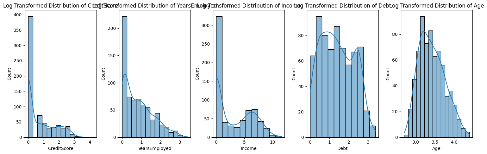
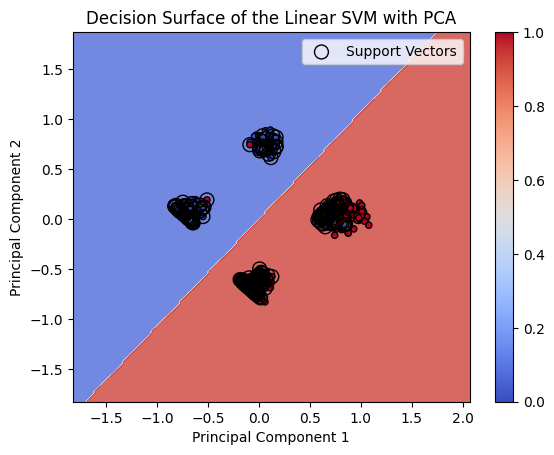
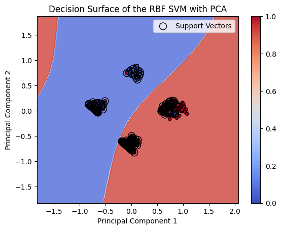
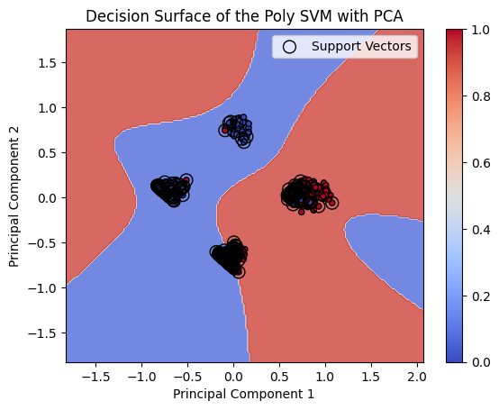
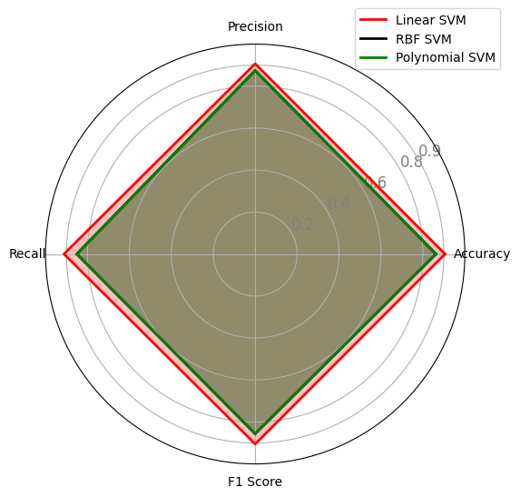

# Credit Card Approval Classification Using SVM

This repository presents our work on **predicting credit card approvals** using multiple Support Vector Machine (SVM) kernels. Our primary objective was to streamline financial risk assessment while ensuring balanced treatment of approved and non-approved cases. Below is an overview of the research, dataset characteristics, and our approach to hyperparameter tuning and model evaluation.

---

## Project Overview

In this project, we explored a **credit card application dataset** of 690 entries, comprising both **numerical** (Age, Debt, YearsEmployed, CreditScore, Income) and **categorical** features (Gender, Employed, PriorDefault, etc.). The ultimate target was a binary variable indicating **approval (1)** or **rejection (0)**. We adopted **SVM** due to its solid theoretical foundation and ability to find an optimal hyperplane or decision boundary in high-dimensional spaces.

---

## Data Preprocessing

1. **Categorical Encoding**:  
   - Employed a mix of **one-hot encoding** for multi-category fields and **binary transformations** for features like Gender, PriorDefault, and DriversLicense.

2. **Feature Selection & Importance**:  
   - Explored Random Forest–based importance rankings and correlation analysis.  
   - Key predictors included **PriorDefault**, **CreditScore**, **YearsEmployed**, **Income**, and **Debt**.

3. **Skewness Handling**:  
   - Applied **log transformations** on skewed features such as CreditScore and Income, achieving a more normal-like distribution.

   

4. **Scaling**:  
   - Used **Min-Max scaler** to normalize numerical attributes, ensuring they all contributed uniformly to the classification process.

---

## Modeling & Experiments

### Hyperparameter Tuning
We performed an exhaustive **Grid Search** with 5-fold cross-validation across:
- **Kernel**: `linear`, `rbf`, `poly`  
- **C**: `{0.1, 1, 10, 100, 150, 200}`  
- **gamma (γ)** for RBF/Poly: `{0.001, 0.01, 0.1, 1, 10}`

### SVM Variants

- **Linear SVM**  
  - Best hyperparameters: `C=0.1`  
  - Balanced precision and recall, with a notable **ROC-AUC of ~0.91**.  
  - Exhibited strong generalization and minimal overfitting.



- **RBF SVM**  
  - Found optimal at `C=100, gamma=0.1`.  
  - Showed slightly higher complexity in decision boundaries, but had a small dip in recall for the negative class.



- **Polynomial SVM**  
  - `C=100, degree=2, coef0=0`.  
  - Performed similarly to RBF in terms of F1 metrics but hinted at overfitting in testing.



### Final Model
The **Linear SVM** emerged as the best compromise between complexity and performance, delivering:
- **Accuracy**: ~0.86 on unseen test data  
- **ROC-AUC**: ~0.91  
- **Precision/Recall**: Balanced for both approved and non-approved classes

---


## Conclusions & Future Directions

1. **Model Simplicity**: Our results underscore the power of a well-tuned **Linear SVM**, which managed to keep pace with (and often surpass) more intricate kernels like RBF and Polynomial.  
2. **Overfitting Check**: Higher-complexity kernels suggested potential overfitting, with a drop in test-set performance.  
3. **Further Steps**:
   - **Cost-sensitive learning** or **SMOTE**-style oversampling to reduce misclassification of positive (approved) cases.  
   - Integrate new features or domain-specific knowledge (e.g., credit history) to improve recall for borderline cases.  
   - Investigate **XGBoost** or **Random Forest** ensembles to compare with the SVM baseline.

---

## Project Structure

The project is structured as follows:

- `Datasets`: Contains the original (`clean_dataset.csv`) and the preprocessed (`preprocessed_data.csv`) datasets.
- `Diagrams`: This directory holds various diagrams generated during the analysis, including decision surface plots and a radar diagram illustrating model comparisons.
- `scripts`: Contains Python scripts for different stages of the project: `evaluation.py`, `main.py`, `preprocess.py`, and `training.py`.
- `src`: Source directory for Jupyter notebooks and model storage.
- `Models`: Stores the serialized final model (`SVM_Linear.joblib`) and Jupyter notebooks detailing data preprocessing (`Data_Preprocessing.ipynb`) and model training (`Model_Training.ipynb`).
- `LICENSE`: The license file.
- `README.md`: The file you are currently reading.
- `requirements.txt`: A list of Python dependencies required to run the project.

## Setup

To set up the project environment, follow these steps:

1. Ensure you have Python 3.8+ installed on your machine.
2. Clone this repository to your local machine.
3. Navigate to the project directory and install the required dependencies:
   
   ```sh
   pip install -r requirements.txt
   ```

4. To activate the virtual environment:

   On Windows:
   ```sh
   .venv\Scripts\activate
   ```
   
   On Unix or MacOS:
   ```sh
   source .venv/bin/activate
   ```
   
## Usage
The Project can be run from main.py as follows:

Run the `main.py` script to initiate the full pipeline, which includes data preprocessing, model training, and evaluation. This script acts as an entry point for the entire project workflow.

Alternatively, you can explore the Jupyter notebooks in the `src` directory for a more interactive experience.


## License

This project is licensed under the [MIT License](https://github.com/ZahirAhmadChaudhry/credit-cards-approval-classification-using-SVM/blob/main/LICENSE).